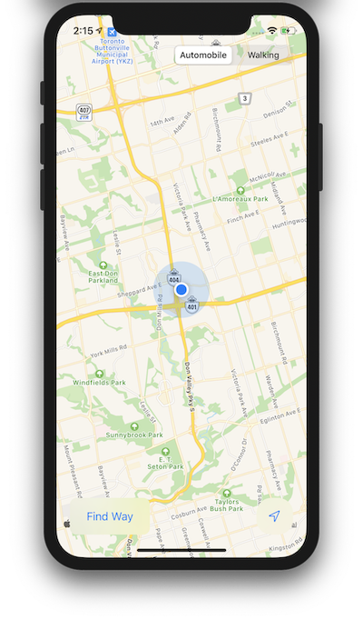
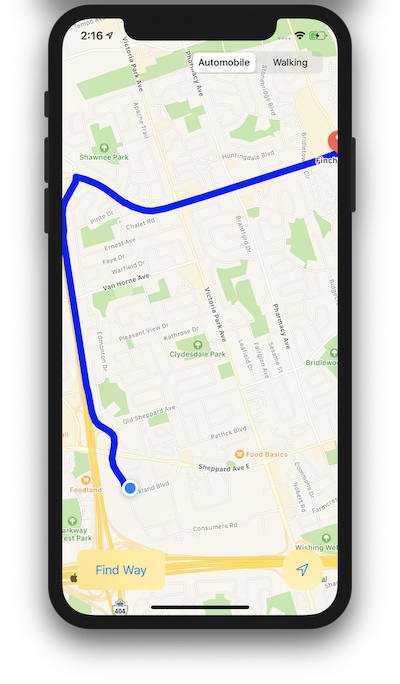
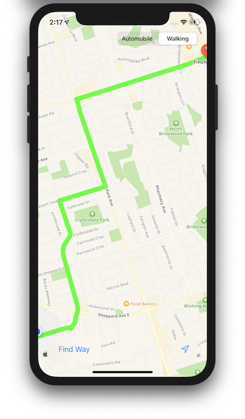
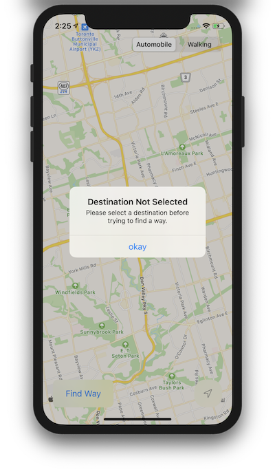

# MapView-App-iOS
Advanced iOS Development Assignment 1
This is an iOS application, created as an Assignment.
The Application shows user location on the Map and the user is able to add a marker on the Map.
When the user clicks on Find Way Button, the map will show the route from the user location to the marker according to what Mode of Transport the user has selected.
The Application also centers to the user location when location button is clicked in the bottom right corner.
The Application also has basic error handling for conditions such as Location Service Disabled, Location Permission check and Unable to get Directions.

Basic:
 

  
Marked Location:
 

  
Route for Automobile:
 

  
Route for Walking:
 

  
General Error Handling:
 

  
